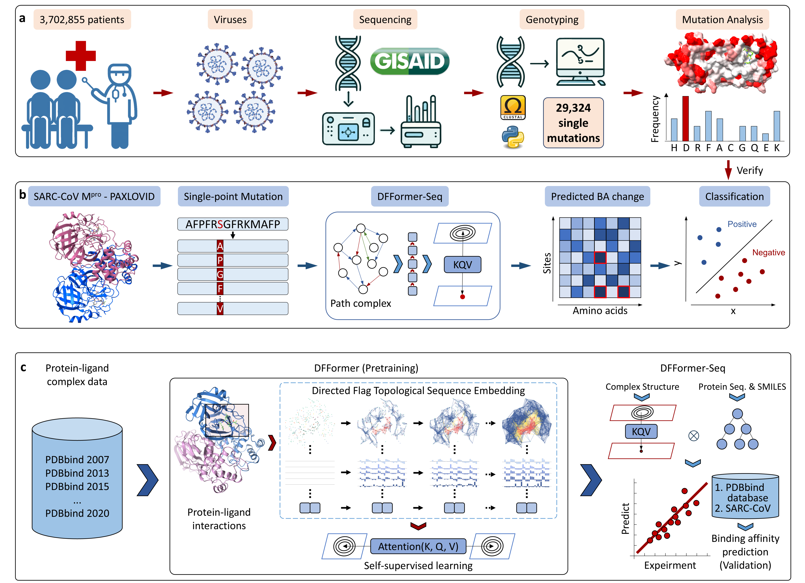

# CAPTURE

<div align='center'>
 
[](https://arxiv.org/html/2403.02603v1) [](https://opensource.org/licenses/MIT)
<!-- [](https://doi.org/10.5281/zenodo.10892800) -->

</div>


CAPTURE (direCted flAg laPlacian Transformer for drUg Resistance prEdictions)


---

## Table of Contents

- [CAPTURE](#capture)
  - [Table of Contents](#table-of-contents)
  - [Introduction](#introduction)
  - [Overall framework](#overall-framework)
  - [Getting Started](#getting-started)
    - [Prerequisites](#prerequisites)
    - [Installation](#installation)
  - [Datasets](#datasets)
  - [Usage](#usage)
    - [Preparing Directed Flag Laplacian Sequence](#preparing-directed-flag-laplacian-sequence)
    - [Fine-Tuning Procedure for Customized Data](#fine-tuning-procedure-for-customized-data)
  - [Results](#results)
      - [Pretrained models](#pretrained-models)
      - [Finetuned models and performances](#finetuned-models-and-performances)
  - [Citation](#citation)
  - [Acknowledgements](#acknowledgements)
  - [Contributors](#contributors)

---

## Introduction

>We developed CAPTURE (direCted flAg laPlacian Transformer for drUg Resistance prEdictions) to analyze the effects of Mpro mutations on nirmatrelvir-Mpro binding affinities and identify potential drug-resistant mutations. CAPTURE combines a comprehensive mutation analysis with a resistance prediction module based on DFFormer-seq, which is a novel ensemble model that leverages a new Directed Flag Transformer and sequence embeddings from the protein and small-molecule-large-language models. Our analysis of the evolution of Mpro mutations revealed a progressive increase in mutation frequencies for residues near the binding site between May and December 2022, suggesting that the widespread use of PAXLOVID created a selective pressure that accelerated the evolution of drug-resistant variants. Applied to mutations at the nirmatrelvir-Mpro binding site, CAPTURE identified several potential resistance mutations, including H172Y and F140L, which have been experimentally confirmed, as well as five other mutations that await experimental verification. CAPTURE evaluation in a limited experimental data set on Mpro mutants gives a recall of 57\% and a precision of 71\% for predicting potential drug-resistant mutations. Our work establishes a powerful new framework for predicting drug-resistant mutations and real-time viral surveillance. The insights also guide the rational design of more resilient next-generation therapeutics.

---

## Overall framework


<!-- {width=66.67%} -->

Further explain the details in the [paper](https://github.com/WeilabMSU/CAPTURE), providing context and additional information about the architecture and its components.

---

## Getting Started

### Prerequisites

- transformers              4.24.0
- numpy                     1.21.5
- scipy                     1.7.3
- pytorch                   1.13.1
- pytorch-cuda              11.7
- scikit-learn              1.0.2
- python                    3.9.12

### Installation

```
git clone https://github.com/WeilabMSU/CAPTURE.git
```

---

## Datasets

| Data name                                                         | Data size | Descriptions       |Resources|
|-------------------------------------------------------------------|-----------|--------------------|---------|
| Combined PDBbind (CASF-2007, 2013, 2016; PDBbind v2015, v2020)    | 19513     | The combined dataset was derived from the PDBbind database, from which duplicates were eliminated. It was excluded binding affinities in the pretraining stage and served as the foundation for self-supervised learning. | [RowData]([www](http://www.pdbbind.org.cn/)), [Features](https://weilab.math.msu.edu/Downloads/CAPTURE/DFFeature_large.npy)                                     |
| PDBbind v2020                                                     | 18904     | The general set from PDBbind v2020 but had to exclude the core sets from CASF-2007, CASF-2013, and CASF-2016. It was utilized for supervised learning in the finetuning stage.                      | 18904 [Label](https://weilab.math.msu.edu/Downloads/CAPTURE/Benchmarks_labels.zip)<br> (exclude core sets)                                                                            |
| CASF-2007 core set                                                | 195       | The CASF-2007 core set, sourced from the PDBbind database, served as the validation set.                                                                                                          | 195 [Label](https://weilab.math.msu.edu/Downloads/CAPTURE/Benchmarks_labels.zip)                        |
| CASF-2013 core set                                                | 195       | The CASF-2013 core set, sourced from the PDBbind database, served as the validation set.                                                                                                          | 285 [Label](https://weilab.math.msu.edu/Downloads/CAPTURE/Benchmarks_labels.zip)                        |
| CASF-2016 core set                                                | 285       | The CASF-2016 core set, sourced from the PDBbind database, served as the validation set.                                                                                                          | 285 [Label](https://weilab.math.msu.edu/Downloads/CAPTURE/Benchmarks_labels.zip)                         |
| SARS-CoV2/CoV                                                   | 203       | Inhibitors of SARS-CoV and/or SARS-CoV-2 main protease with corresponding binding affinities, abbreviated as SARS-CoV2/CoV.                                                                      | [Download](https://weilab.math.msu.edu/Downloads/CAPTURE/SARS_CoV2_CoV_structures.zip)                                       |
| SARS-CoV-2 MM                                                     | 418       | 21 single-site mutations, along with the activation of mutant site P132 on the SARS-CoV-2 M$^{pro}$ enzyme, were introduced, forming complexes with the FDA-approved drug PAXLOVID.                | [Download](https://weilab.math.msu.edu/Downloads/CAPTURE/mutant_complexes_opt.zip)                                                                                              |


- RowData: the protein-ligand complex structures. From PDBbind
- DFFeature: the topological embedded features for the protein-ligand complex. All features are saved in a dict, which `key` is the protein ID, and `value` is the topological embedded features for corresponding complex. The downloaded file is containing `DFFeature_large.npy`: topological embedded features with a filtration parameter ranging from 0 to 10 and incremented in steps of 0.1 \AA; 
- Label: the .csv file, which contains the protein ID and corresponding binding affinity in the logKa unit.

---

## Usage

### Preparing Directed Flag Laplacian Sequence

```shell
# get the usage
python ./code_pkg/main_potein_ligand_pathLaplacian_embedding.py -h

# examples
python ./code_pkg/main_potein_ligand_pathLaplacian_embedding.py --output_feature_folder "../examples/output_topo_seq_feature_result" --protein_file "../examples/protein_ligand_complex/1a1e/1a1e_pocket.pdb" --ligand_file "../examples/protein_ligand_complex/1a1e/1a1e_ligand.mol2" --dis_start 0 --dis_cutoff 5 --consider_field 20 --dis_step 0.1
```

### Fine-Tuning Procedure for Customized Data

```shell
bs=32 # batch size
lr=0.00008  # learning rate
ms=10000  # max training steps
fintuning_python_script=./code_pkg/DFF_regression_finetuning.py
model_output_dir=./outmodel_finetune_for_regression
mkdir $model_output_dir
pretrained_model_dir=./pretrained_model
scaler_path=./code_pkg/pretrain_data_standard_minmax_6channel_large.sav
validation_data_path=./CASF_2016_valid_feat.npy
train_data_path=./CASF_2016_train_feat.npy
validation_label_path=./CASF2016_core_test_label.csv
train_label_path=./CASF2016_refine_train_label.csv

# finetune for regression on one GPU
CUDA_VISIBLE_DEVICES=1 python $fintuning_python_script --hidden_dropout_prob 0.1 --attention_probs_dropout_prob 0.1 --num_train_epochs 100 --max_steps $ms --per_device_train_batch_size $bs --base_learning_rate $lr --output_dir $model_output_dir --model_name_or_path $pretrained_model_dir --scaler_path $scaler_path --validation_data $validation_data_path --train_data $train_data_path --validation_label $validation_label_path --train_label $train_label_path --pooler_type cls_token --random_seed 1234 --seed 1234;
```

---

## Results

#### Pretrained models
- Pretrained DFFormer model. [Download](https://weilab.math.msu.edu/Downloads/CAPTURE/pretrained_dfformer.zip)

#### Finetuned models and performances

| Model           | Training set    | CASF-2007 core set       | CASF-2013 core set       | CASF-2016 core set      |
|-----------------|-----------------|--------------------------|--------------------------|-------------------------|
| Pafnucy         | v2016 (11906)   |                          |                          | 0.78                    |
| Deep Fusion     | v2016 (9226)    |                          |                          | 0.803 (1.809) ^a        |
| graphDelta      | v2018 (8766)    |                          |                          | 0.87 (**1.431**) ^a     |
| DeepAtom        | v2018 (9383)    |                          |                          | 0.831 (1.680) ^a        |
| SE-OnionNet     | v2018 (11663)   |                          | 0.812 (2.307)            | 0.83                    |
| ECIF            | v2019 (9299)    |                          |                          | 0.866 (1.594)           |
| OnionNet-2      | v2019 (>9000)   |                          | 0.821 (1.850)            | 0.864 (1.587)           |
| PLANET          | v2020 (15616)   |                          |                          | 0.824 (1.700) ^a        |
| HydraScreen     | v2020 ^b        |                          |                          | 0.86 (1.568)            |
| Point VS        | v2020 (19157)   |                          |                          | 0.816                   |
| HAC-Net         | v2020 (18818)   |                          |                          | 0.846 (1.643)           |
| DFFormer-Seq    | v2020 (18904)   | **0.853** (**1.766**)[result](./Results/casf2007_consensus_score.csv)    | **0.832** (**1.772**)[result](./Results/casf2013_consensus_score.csv)    | **0.882** (**1.492**)[result](./Results/casf2016_consensus_score.csv)   |
|                 |                 |                          |                          | **0.884** (1.479)^a [result](./Results/v2016_consensus_score.csv)    |

- ^a indicates the use of the PDBbind-v2016 core set (N = 290) as the test dataset.
- ^b specifies the number of training set samples not mentioned.
- The best result across all methods is highlighted in bold.
- RMSE is measured in kcal/mol.
- There are 20 DFFormers are trained for each dataset with distinct random seeds to address initialization-related errors. And 20 gradient boosting regressor tree (GBRT) models are subsequently trained one these sequence-based features, which predictions can be found in the [results](./Results) folder. Then, the consensus predictions of all these models was used as the final prediction result.

---

## Citation

If you use this code or the pre-trained models in your work, please cite our work.
- Chen, Dong, Gengzhuo Liu, Hongyan Du, Benjamin Jones, Junjie Wee, Rui Wang, Jiahui Chen, Jana Shen, and Guo‐Wei Wei. "Drug resistance predictions based on a directed flag transformer." Advanced Science 12, no. 36 (2025): e02756. https://advanced.onlinelibrary.wiley.com/doi/10.1002/advs.202502756

---

## Acknowledgements

This project has benefited from the use of the [Transformers](https://github.com/huggingface/transformers) library. Portions of the code in this project have been modified from the original code found in the Transformers repository.

---

## Contributors
CAPTURE was developed by [Dong Chen](https://github.com/ChenDdon) and is maintained by [WeiLab at MSU Math](https://github.com/WeilabMSU)
